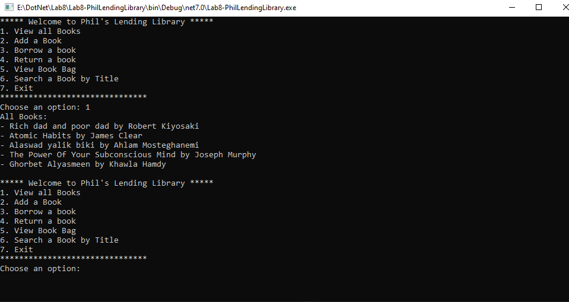

# Phil's Lending Library

## Summary

Phil's Lending Library is a Console application that simulates a lending library where you can add books, search books, borrow books, return books, and store borrowed books in a backpack. It provides a simple and interactive interface to manage books in the library.

## Visuals

Here's an example of how Phil's Lending Library looks like in action:

## Usage

To use Phil's Lending Library, follow these step-by-step directions:

1. Launch the application by cloning the project on your device ,open it in Visual studio ,build and run it.

2. You will be presented with a menu of options:
   - Option 1: View all Books
     - This option displays all the books currently available in the library.
   - Option 2: Add a Book
     - This option allows you to add a new book to the library by providing the title, author, and other details.
   - Option 3: Borrow a Book
     - This option lets you borrow a book from the library by entering the title of the book you want to borrow.
   - Option 4: Return a Book
     - This option allows you to return a book to the library. You will be prompted to select a book from your backpack to return.
   - Option 5: Search a Book by Title
     - This option enables you to search for a book in the library by its title. Enter the title you want to search for, and the application will display the book details if found.
   - Option 6: View Book Bag
     - This option shows you the list of books currently in your backpack.
   - Option 7: Exit
     - Selecting this option will exit the application.

3. Choose an option by entering the corresponding option number.

4. Follow the on-screen instructions to perform the desired action.

5. Continue using the application by selecting different options from the menu.

## Other Details

- The library allows case-insensitive search by title. You can search for a book by its title using the search option.
- The library maintains a backpack where you can store borrowed books. The backpack can be used to pack and unpack items.
- The application provides feedback and prompts for user input to guide you through the available options.
- The book information is stored in memory during runtime and is not persisted across sessions.
- The project functionality is fully tested you can check the ests [Here](./TestProject1/UnitTest1.cs). 

That's all you need to know to start using Phil's Lending Library! Enjoy managing your books and happy reading!

